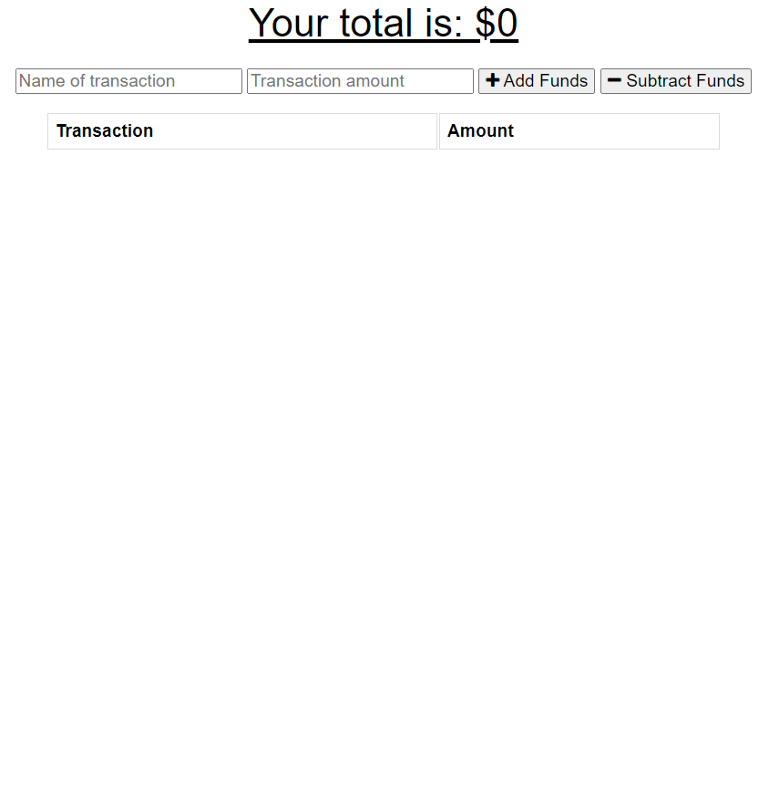
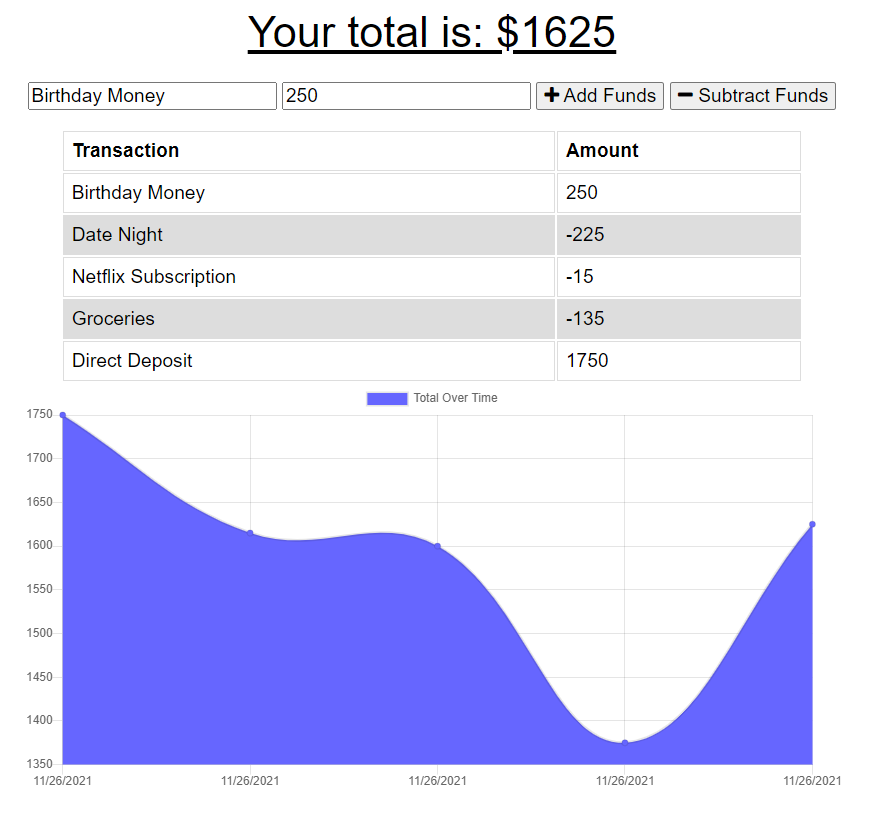

# Finance_Tracker

A web application that allows the user to keep track of their finances. The application uses MongoDB as the database for transactions and Chart JS in order to display the chart.

## Table of contents

- [Overview](#overview)
  - [Screenshot](#screenshot)
  - [Links](#links)
- [My process](#my-process)
  - [Built with](#built-with)
  - [What I learned](#what-i-learned)
- [Author](#author)

## Overview

### Screenshot

- This is the landing page for the finance tracker.

- Once the user adds multiple transactions a graph begins to form.

### Links

- Live Site URL: [Deployed Heroku URL](https://finance-trckr.herokuapp.com/)

## My process

### Built with

- HTML5
- CSS
- JavaScript
- Font Awesome
- Node.js
- MongoDB
- Mongoose
- Webpack
- Chart JS

### What I learned

While doing this project I learned a lot about working on Progressive Web Applications(PWA). This application was made with Webpack in order to make the web application into a PWA and I also put in a service worker to keep data stored for the user but unfortunately it is not working as I hoped. My favorite feature is the chart that is provided by using Chart JS because it makes the application feel like it has a lot more depth, plus it is fairly easy to learn.

## Author

- Website - [Jack Ceballos](https://jceb30198.github.io/#/)
- LinkedIn - [Jack's LinkedIn](https://www.linkedin.com/in/jackceballosmia/)
- Frontend Mentor - [@jceb30198](https://www.frontendmentor.io/profile/jceb30198)
